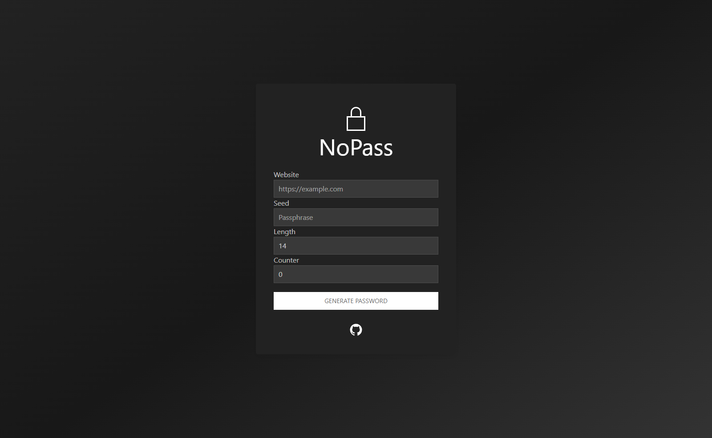

NoPass
------

A simple password manager alternative that eliminates the need to store passwords.

[ [How does it work](#how-does-it-work) ]
[ [Screenshots](#screenshots) ]
[ [Prerequisites](#prerequisites) ]
[ [Features](#features) ]
[ [Getting started](#getting-started) ]
[ [License](#license) ]

## How it works:

Enter a website and seed phrase, adjust the length and counter as desired and generate a unique password that can be regenerated at any time using a pure js function.

## 📷 Screenshots




## 🛠️ Prerequisites

[Node, npm](https://docs.npmjs.com/downloading-and-installing-node-js-and-npm)

## 🚀 Getting started

#### Install the dependencies

```shell
npm install
```

*To update all the dependencies to the latest versions run* `npm update --save`

#### Run the dev server

```shell
npm start
```

The project should be available at http://localhost:1234.

#### Build for production

To generate a production bundle of your project run `npm run build`, your build will be created in a `dist` directory.

## 📝 License

Copyright 2023 I Services. [MIT License](LICENSE.md)